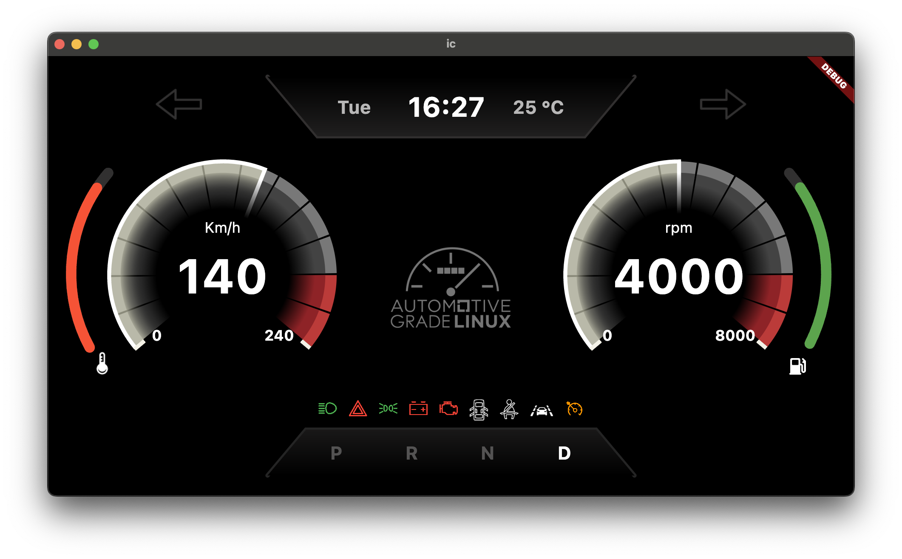
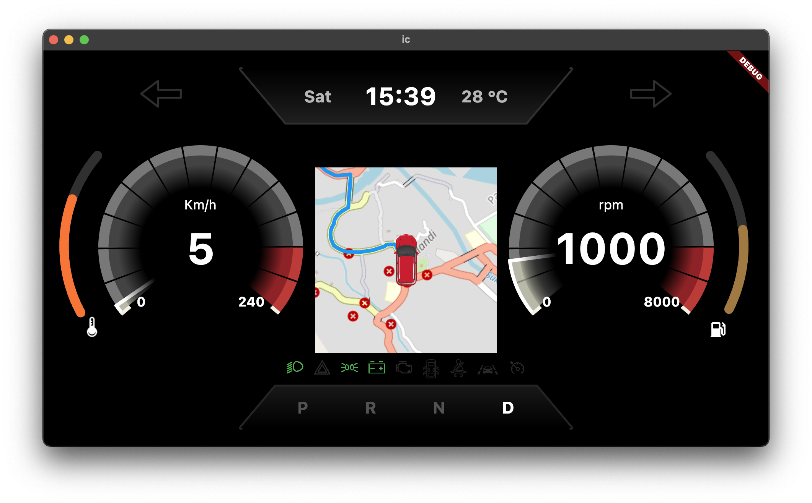

## Instrument Cluster Demo App 
Instrument Cluster for AGL flutter build

#Screenshot

*To run this app, we need Flutter SDK, KUKSA server, free account at openrouteservice.org for the API key and config.YAML file*

#Steps to run the app

- Run KUSKA.VAL server. For more details, checkout [this](https://github.com/eclipse/kuksa.val/tree/master/kuksa-val-server)
- Install the kuksa_viss_client. Follow [this](https://github.com/eclipse/kuksa.val/tree/master/kuksa_viss_client)
- Connect to server, authorize then updateVSSTree using [steering_switch_signal.json](extras/steering_switch_signal.json)
- Create a config.YAML file. Reference: [cluster_config.yaml](extras/cluster_config.yaml)
- Create a file for API key. Reference: [openrouteservice](extras/openrouteservice)
- Update the path of both files in the source code. [Here](lib/cluster_config.dart#L24-L25) 
 
- Go to the project directory
- First run `flutter create .`
- Then to run the app `flutter run`

*Note: Set the appropriate permission in the platform specific file for network and file system access*
